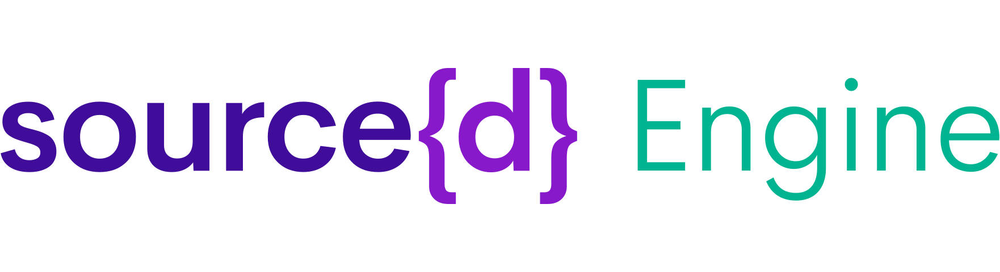

<a href="https://www.sourced.tech/engine">
  
</a>

**Powerful language-agnostic analysis of your source code and git history.**

[](https://github.com/src-d/engine/releases)
[](https://travis-ci.org/src-d/engine)
[](https://goreportcard.com/report/github.com/src-d/engine)
[](https://godoc.org/github.com/src-d/engine)
[](https://drive.google.com/open?id=1Fw-qE8mC3lZUP5hoH1Jo5bYcGV0Z018uAq7er3oAMLw)

[Website](https://www.sourced.tech/engine) •
[Documentation](https://docs.sourced.tech/engine) •
[Blog](https://blog.sourced.tech) •
[Slack](http://bit.ly/src-d-community) •
[Twitter](https://twitter.com/sourcedtech)


## Introduction

source{d} Engine exposes powerful Universal AST's to analyze your code and a SQL engine to analyze your git history:

- **Code Retrieval**: retrieve and store git repositories as a dataset.
- **Language Agnostic Code Analysis**: automatically identify languages, parse source code, and extract the pieces that matter in a completely language-agnostic way.
- **Git Analysis**: powerful SQL based analysis on top of your git repositories.
- **Querying With Familiar APIs**: analyze your code through powerful friendly APIs, such as SQL, gRPC, REST, and various client libraries.

You can find a version of this docummentation, properly rendered, at https://docs.sourced.tech/engine.


## Contents

- [Quickstart](#quickstart)
- [Guides & Examples](#guides-and-examples)
- [Architecture](#architecture)
- [Babelfish UAST](#babelfish-uast)
- [Clients & Connectors](#clients-and-connectors)
- [Community](#community)
- [Contributing](#contributing)
- [Credits](#credits)
- [License](#license)

## Quickstart

Follow the steps below to get started with source{d} Engine.

#### 1. Install Docker

Follow these instructions:

- [Docker Desktop for Mac](https://store.docker.com/editions/community/docker-ce-desktop-mac). Or, if you prefer to use [Homebrew](https://brew.sh/):
  ```bash
  brew cask install docker
  ```
- [Docker for Ubuntu](https://docs.docker.com/install/linux/docker-ce/ubuntu/#install-docker-ce-1)
  ```bash
  sudo apt-get update
  sudo apt-get install docker-ce
  ```
- [Docker for Arch Linux](https://wiki.archlinux.org/index.php/Docker#Installation)
  ```bash
  sudo pacman -S docker
  ```
- [Docker Desktop for Windows](https://hub.docker.com/editions/community/docker-ce-desktop-windows). Make sure to read the system requirements [here](https://docs.docker.com/docker-for-windows/install/). Please note Docker Toolbox is not supported.

#### 2. Install source{d} Engine

Download the **[latest release](https://github.com/src-d/engine/releases)** for MacOS (Darwin), Linux or Windows. *The support for Windows is currently experimental.*

**MacOS:**

Double-click on the tar file to extract it.

Open your terminal and move it into your local bin folder to make it executable from anywhere:

```bash
sudo mv ~/replace/path/to/engine_darwin_amd64/srcd /usr/local/bin/
```

**Linux:**

Extract the tar file from your terminal:
```bash
tar -xvf ~/replace/path/to/engine_REPLACEVERSION_linux_amd64.tar.gz
```

Move it into your local bin folder to be executable from anywhere:
```bash
sudo mv engine_linux_amd64/srcd /usr/local/bin/
```

**Windows:**

*The support for Windows is currently experimental.*

*Please note that from now on we assume that the commands are executed in `powershell` and not in `cmd`. Running them in `cmd` is not guaranteed to work. Proper support may be added in future releases.*

To run the following preparatory steps you need to run powershell as administrator.

```powershell
mkdir 'C:\Program Files\srcd'
# Add the directory to the `%path%` to make it available from anywhere
setx /M PATH "$($env:path);C:\Program Files\srcd"
# Now open a new powershell to apply the changes
```

Extract the tar file with the tool you prefer. Copy `srcd.exe` into the directory you created:
```powershell
mv engine_windows_amd64\srcd.exe 'C:\Program Files\srcd'
```

#### 3. Start source{d} Engine with your local repositories

Now it's time to initialize the source{d} engine and provide it with some repositories to analyze:

```bash
# Without a path it operates on the local folder,
# it works with nested folders.
srcd init

# You can also provide a path
srcd init /home/user/replace/path/
```

```powershell
# On Windows you can use both slashes and backslashes
srcd init C:/Users/some/path
srcd init C:\Users\some\path
```

**Note:** Ensure that you initialize source{d} Engine every time you want to process a new repository. Changes in the `init` working directory are not detected automatically.

**Note for MaOS:** Docker for Mac [requires file sharing](https://docs.docker.com/docker-for-mac/troubleshoot/#volume-mounting-requires-file-sharing-for-any-project-directories-outside-of-users) for any path outside of `/Users`.

**Note for Windows:** Docker for Windows [requires shared drives](https://docs.docker.com/docker-for-windows/#shared-drives). Other than that, it's important to use a workdir that doesn't include any sub-directory whose access is not readable by the user running `srcd`. As an example using `C:\Users` as workdir will most probably not work. For more details see [this issue](https://github.com/src-d/engine/issues/250).

#### 4. Explore the source{d} Engine

To launch the [web client for the SQL interface](https://github.com/src-d/gitbase-web), run the following command and start executing queries:

```bash
srcd web sql
```

The first time you run some of these commands, the source{d} Engine will download and install the Docker containers that are needed. Be aware that this might take a bit of time, it is only on your first use.

If you prefer to stay with the command line, you can execute:

```bash
srcd sql
```

This will open a SQL REPL that allows you to execute queries against your repositories.

If you want to run a query directly, you can also execute it as such:

```bash
srcd sql "SHOW tables;"
```

You might have noticed that some queries below use the UAST function. This is to transform code to a [Universal Abstract Syntax Tree](#babelfish-uast). If you want a playground to see examples of the UAST, or run your own, you can launch the parse web client.

**Note:** queries using the UAST function are meant for the `web sql` interface. The column for UAST will be seen as binary data in the CLI.

To see which languages are available, check the table of [supported languages](https://docs.sourced.tech/babelfish/languages).

The first time you launch the web client, it will download and install the recommended drivers (those that are beta or higher).

```bash
# Launch the web client
srcd web parse
```

Alternatively you can also start parsing files on the command line:

```bash
srcd parse uast /path/to/file.java
```

#### 5. Start executing queries

**Understand which tables are available to you to query**:
```bash
gitbase> show tables;
+--------------+
|    TABLE     |
+--------------+
| blobs        |
| commit_blobs |
| commit_files |
| commit_trees |
| commits      |
| files        |
| ref_commits  |
| refs         |
| remotes      |
| repositories |
| tree_entries |
+--------------+
```

```bash
gitbase> DESCRIBE TABLE commits;
+---------------------+-----------+
|        NAME         |   TYPE    |
+---------------------+-----------+
| repository_id       | TEXT      |
| commit_hash         | TEXT      |
| commit_author_name  | TEXT      |
| commit_author_email | TEXT      |
| commit_author_when  | TIMESTAMP |
| committer_name      | TEXT      |
| committer_email     | TEXT      |
| committer_when      | TIMESTAMP |
| commit_message      | TEXT      |
| tree_hash           | TEXT      |
| commit_parents      | JSON      |
+---------------------+-----------+
```

**Show me the repositories I am analyzing**:

```sql
SELECT * FROM repositories;
```

**Top 10 repositories by commit count in [HEAD](https://git-scm.com/book/en/v2/Git-Internals-Git-References#ref_the_ref)**:

```sql
SELECT repository_id,commit_count
FROM (
    SELECT r.repository_id, COUNT(*) AS commit_count
    FROM ref_commits r
    WHERE r.ref_name = 'HEAD'
    GROUP BY r.repository_id
) AS q
ORDER BY commit_count
DESC
LIMIT 10;
```

**Query all files from [HEAD](https://git-scm.com/book/en/v2/Git-Internals-Git-References#ref_the_ref)**:

```sql
SELECT cf.file_path, f.blob_content
FROM ref_commits r
NATURAL JOIN commit_files cf
NATURAL JOIN files f
WHERE r.ref_name = 'HEAD'
AND r.history_index = 0;
```

**Retrieve the UAST for all files from [HEAD](https://git-scm.com/book/en/v2/Git-Internals-Git-References#ref_the_ref)**:

```sql
SELECT * FROM (
    SELECT cf.file_path,
           UAST(f.blob_content, LANGUAGE(f.file_path,  f.blob_content)) as uast
    FROM ref_commits r
    NATURAL JOIN commit_files cf
    NATURAL JOIN files f
    WHERE r.ref_name = 'HEAD'
    AND r.history_index = 0
) t WHERE uast != '';
```

**Query for all LICENSE & README files across history**:

```sql
SELECT repository_id, blob_content
FROM files
WHERE file_path = 'LICENSE'
OR file_path = 'README.md';
```

You can find further sample queries in the [examples](examples/README.md) folder.

<!---
#### 6. Next steps

You can now run the source{d} Engine, choose what you would like to do next:

- [**Analyze your git repositories**](#)
- [**Understand how your code has evolved**](#)
- [**Write your own static analysis rules**](#)
- [**Build a data pipeline for MLonCode**](#)
--->

## Guides and Examples

For the full list of the commands supported by `srcd` and those
that have been planned, please read [commands.md](docs/commands.md).

Collection of guides & examples using the source{d} Engine:

- [SonarSource Java Static Analysis Rules using Babelfish](https://github.com/bblfsh/sonar-checks)
- A lot more coming soon!

## Architecture

source{d} Engine functions as a CLI tool that provides easy access to components of the source{d} stack for Code As Data. It consists of a daemon managing all of the services (Babelfish, Enry, Gitbase etc.) which are packaged as docker containers.

<p align="center"></p>

For more details on the architecture of this project, read [docs/architecture.md](docs/architecture.md).

## Babelfish UAST

One of the most important components of the source{d} engine is the UAST.

UAST stands for [Universal Abstract Syntax Tree](https://docs.sourced.tech/babelfish/uast/uast-specification), it is a normalized form of a programming language's AST, annotated with language-agnostic roles and transformed with language-agnostic concepts (e.g. Functions, Imports etc.). It enables advanced static analysis of code and easy feature extraction for statistics or Machine Learning on Code.

To parse a file for a UAST, it is as easy as:

```bash
srcd parse uast --lang=LANGUAGE /path/to/file
```

To launch the web client, run the following command and start executing queries*:

```bash
srcd web parse
```

To see the installed language drivers:

```bash
srcd parse drivers list
```

to install others, use:

```
srcd parse drivers install python
```

To see which languages are available, check the table of [supported languages](https://docs.sourced.tech/babelfish/languages).

## Clients and Connectors

For connecting to the language parsing server (Babelfish) and analyzing the UAST, there are several language clients currently supported and maintained:

- [Babelfish Go Client](https://github.com/bblfsh/client-go)
- [Babelfish Python Client](https://github.com/bblfsh/client-python)
- [Babelfish Scala Client](https://github.com/bblfsh/client-scala)

The Gitbase Spark connector is under development, which aims to allow for an easy integration with Spark & PySpark:

- [Gitbase Spark Connector](https://github.com/src-d/gitbase-spark-connector) - coming soon!

## Community

source{d} has an amazing community of developers and contributors who are interested in Code As Data and/or Machine Learning on Code. Please join us! 👋

- [Slack](http://bit.ly/src-d-community)
- [Twitter](https://twitter.com/sourcedtech)
- [Email](mailto:hello@sourced.tech)

## Contributing

Contributions are **welcome and very much appreciated** 🙌
Please refer [to our Contribution Guide](CONTRIBUTING.md) for more details.

## Credits

This software uses code from several open source packages. We'd like to thank the contributors for all their efforts:

- [Cobra](https://github.com/spf13/cobra)

## License

[Apache 2.0 License](LICENSE)
